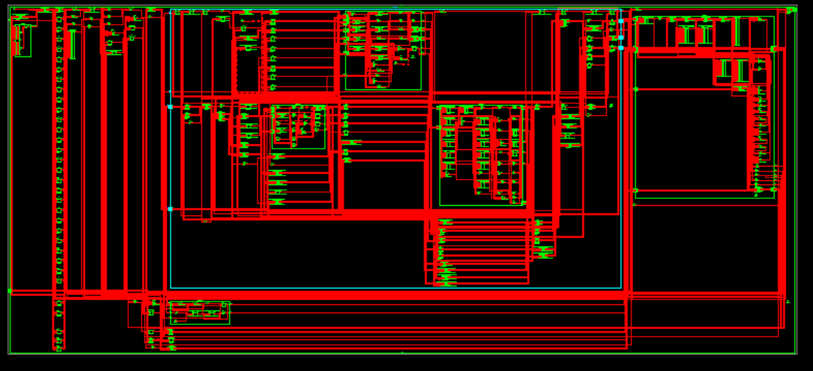
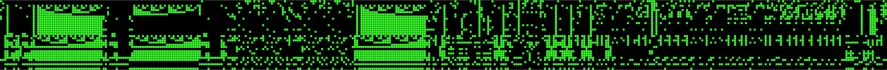

# TINY MIPS

We implement a tiny MIPS CPU with a tiny OS running on it.

The OS only need the following instructions:
- addu & addiu
- slt
- beq & bne
- j & jr

# USTC tMIPS Memory Mapping Documentation

## Overview

While no bus existing in the CPU, the port to `data_mem` act as a bus in fact. The `address` is used to switch between devices, including I/O, interrupt, and the `0x2000` started data RAM. All the special devices act as a register, writing to the writable ones will so cause some effects wanted.

The mapping is as following.

| Address Space           | Content                |
|-------------------------|------------------------|
| 0x00002000 ~ 0x00003FFC | Data Memory            |
| 0xFFFF0000 ~ 0xFFFF007C | I/O                    |
| 0xFFFF0080 ~ 0xFFFF00FC | Interrupt Register Map |
| 0xFFFF0100              | Interrupt Enabled      |
| 0xFFFF0104              | Interrupt Mask         |

## I/O

For every I/O device, there is a 32-bit-wide buffer for it to do the I/O work. For input devices, this register is read only; for output ones, it's write only. Every such register is placed at the I/O memory map space, and takes 4 bytes. 

All I/O mappings is as following.

| Address    | Content      |
|------------|--------------|
| 0xFFFF0000 | Led Output   |
| 0xFFFF0004 | Switch Input |

## Interrupt

For every interrupt source, there is a 1-bit register representing if this interrupt exists and needs to be processed. If any of these registers is set high by I/O devices, the interrupt unit will trigger a interrupt and send a request to the processor. Interrupt service routine needs to reset these bit to tell the interrupt unit that "I served this interrupt."

For every register described as above, it is spared a full double word memory mapping space, thus they can be addressed directly with a normal address, and read and write with `lw` and `sw`.

All interrupt register mappings is as following.

| Address    | Interrupt Source   |
|------------|--------------------|
| 0xFFFF0080 | Switch             |
| 0xFFFF0084 | Time Tick Counter  |
| 0xFFFF0088 | Software-Triggered |

Caution: No interrupt register is able to be written with a `1`, expect the Software-Triggered interrupt; if not so, every interrupt will be able to be used as a soft interrupt, which is not what we expect.

Also, there is a `interrupt_enabled` 1-bit register representing if a interrupt should be triggered currently. Interrupt request is possible to be sent only when this bit is high. Once an interrupt is triggered, this bit will be set low to prevent replicated triggering the same interrupt. So, interrupt service routine should turn this bit high right before the Return-From-Interrupt `jr` instruction, with a `sw` instruction. Also, this register is spared a double word space, to be visited easily; and writing any non-zero value will set the register high, or low if zero.

The `interrupt_enabled` register is mapped to `0xFFFF0100`.

Also, there is a 32-bit register named `interrupt_mask` representing if one interrupt is available. Set one of these bits will cause corresponding interrupt to be ignored.

The `interrupt_mask` register is mapped to `0xFFFF0104`.
